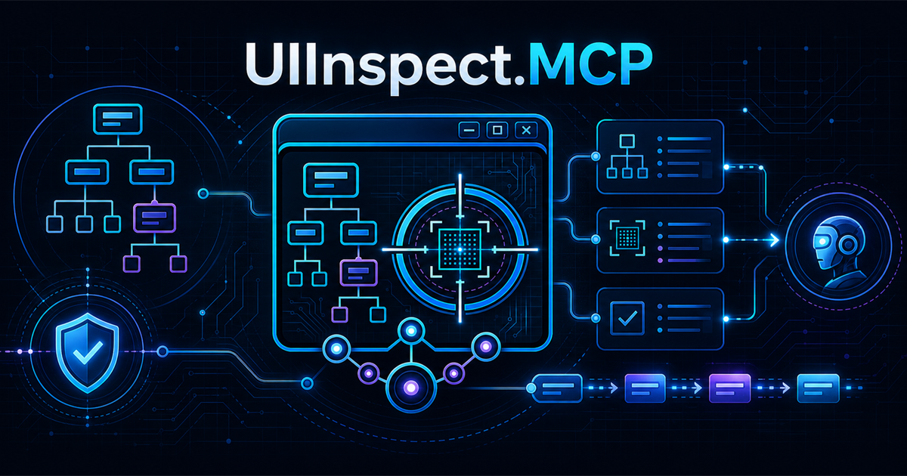

# UIInspect.MCP

UIInspect.MCP is a consent-gated C# Model Context Protocol server that gives AI agents semantic access to Windows applications through UI Automation 3 (UIA3). The MVP discovers and attaches to WPF, WinForms, WinUI, Avalonia, and .NET MAUI Windows application windows when those frameworks expose standard UIA providers. It returns a bounded control tree and performs deterministic actions against opaque element references instead of relying on pixel coordinates.

The host uses `ModelContextProtocol` 1.4.1, .NET 10, FlaUI 5.0 UIA3, stdio transport, TUnit, and Microsoft Testing Platform.

## MVP status

Implemented:

- Top-level window discovery with process-instance identity and native handles.
- Explicit trusted Windows approval dialog for each process instance.
- Attach by process ID with optional native window handle.
- Bounded, flattened UIA control-tree snapshots.
- Opaque, generation-scoped element references plus explanatory semantic paths.
- Password-element redaction and no control-value collection during inspection.
- Invoke, resolved click, ValuePattern set, SelectionItemPattern select, expand/collapse, and allowlisted logical keys.
- Per-client/process consent, expiry, PID-reuse checks, rate limits, append-only redacted JSONL audit, and deterministic session cleanup.
- Deterministic WPF and WinForms fixture applications.
- TUnit/MTP unit and live Windows integration tests.

Deferred to later milestones:

- XAML source/visual trees, dependency properties, bindings, validation, DataContext, command diagnostics, and hot reload hooks. UIA does not expose these; they require the explicitly enabled in-process agent described by the design.
- Screenshots/overlays, recording/replay, virtualization helpers, UIA2 fallback, TCP transport, and signed CI client tokens.
- Dedicated WinUI, Avalonia, and MAUI fixture suites. Their standard controls can already be reached through UIA3, but each provider needs a separate compatibility suite and packaging/runtime setup.

No DLL injection, arbitrary reflection, OCR, screen scraping, shell execution, or generic property writes are present in the MVP.

## Architecture

```text
MCP client
   │ stdio JSON-RPC
   ▼
UIInspect.MCP.Server
   │ tool adapters only
   ▼
UIInspect.MCP.Core
   │ process-instance consent + authorization + rate limits + audit + sessions
   ▼
UIInspect.MCP.Windows
   │ serialized FlaUI/UIA3 adapter + semantic locator re-resolution
   ▼
Target process accessibility provider
```

Projects:

| Project | Responsibility |
|---|---|
| `UIInspect.MCP.Core` | Platform-neutral contracts, result models, consent registry, rate limiting, auditing, and coordinator |
| `UIInspect.MCP.Windows` | Windows process identity, trusted consent UI, FlaUI UIA3 discovery/session adapter |
| `UIInspect.MCP.Server` | MCP 1.4.1 stdio host and controlled tool registry |
| `UIInspect.Sample.Wpf` | Deterministic WPF UIA fixture |
| `UIInspect.Sample.WinForms` | Deterministic WinForms UIA fixture |
| `UIInspect.MCP.Tests` | TUnit/MTP unit, host, and live UIA integration tests |

## Build and test

Requirements:

- Windows 10/11 with an interactive desktop.
- .NET SDK 10.0.301 or a compatible feature band.
- The server must run in the same Windows logon session and at a sufficient integrity level for its target.

```powershell
dotnet restore .\UIInspect.MCP.slnx
dotnet build .\UIInspect.MCP.slnx -c Release --no-restore
dotnet test .\src\UIInspect.MCP.Tests\UIInspect.MCP.Tests.csproj -c Release --no-build --no-restore -- `
  --coverage `
  --coverage-settings .\eng\coverage.runsettings `
  --coverage-output .\artifacts\coverage\coverage.cobertura.xml `
  --coverage-output-format cobertura `
  --report-trx `
  --no-progress
```

The coverage allowlist includes the three production assemblies and excludes only test assemblies, fixture applications, compiler-generated sources, and methods with a reviewed `ExcludeFromCodeCoverage` justification. The gate is 100% of eligible production code; inspect the Cobertura report for exact line and branch metrics.

## Run

From source:

```powershell
dotnet run --project .\src\UIInspect.MCP.Server\UIInspect.MCP.Server.csproj -c Release
```

The MCP protocol owns stdout. All console logging goes to stderr.

Example local MCP client configuration:

```json
{
  "servers": {
    "uiinspect": {
      "type": "stdio",
      "command": "dotnet",
      "args": [
        "run",
        "--project",
        "D:\\Projects\\Github\\chrispulman\\UIInspect.MCP\\src\\UIInspect.MCP.Server\\UIInspect.MCP.Server.csproj",
        "-c",
        "Release"
      ]
    }
  }
}
```

The same stdio command can be used by Codex, VS Code, Visual Studio 2022/2026 MCP-capable agent integrations, and other MCP clients. Adjust only the client-specific configuration container.

Set `UIINSPECT_AUDIT_PATH` to override the default audit location at `%LOCALAPPDATA%\UIInspect.MCP\audit\actions.jsonl`.

## MCP tools

| Tool | Purpose | Consent |
|---|---|---|
| `uiinspect_discover_windows` | List top-level UIA windows | Rate-limited discovery |
| `uiinspect_request_consent` | Show the trusted local approval dialog | Local user decision |
| `uiinspect_attach` | Open an opaque session for PID/HWND | Inspect |
| `uiinspect_inspect_tree` | Return a bounded semantic snapshot | Inspect |
| `uiinspect_invoke` | Use InvokePattern | Interact |
| `uiinspect_click` | Click a semantically resolved element | Interact |
| `uiinspect_set_value` | Use ValuePattern | Interact |
| `uiinspect_set_text` | Text alias for ValuePattern | Interact |
| `uiinspect_select_item` | Use SelectionItemPattern | Interact |
| `uiinspect_expand_collapse` | Use ExpandCollapsePattern | Interact |
| `uiinspect_send_key` | Send one allowlisted logical key after focus | Keyboard |
| `uiinspect_close_session` | Dispose a session | Session owner |

Every successful action invalidates the current element-reference generation. Call `uiinspect_inspect_tree` again before the next action.

## Safe workflow

1. Call `uiinspect_discover_windows`.
2. Identify the intended process and window independently.
3. Call `uiinspect_request_consent`; the local user must approve the exact process instance and capability set.
4. Call `uiinspect_attach`.
5. Call `uiinspect_inspect_tree` with the smallest useful depth and node budget.
6. Prefer pattern-first tools (`invoke`, `set_value`, `select_item`, `expand_collapse`) over `click` or keyboard.
7. Re-inspect after every successful action.
8. Call `uiinspect_close_session`.

See [Security](docs/security.md) for the threat model and [MVP design](docs/mvp-design.md) for current boundaries and later milestones.
